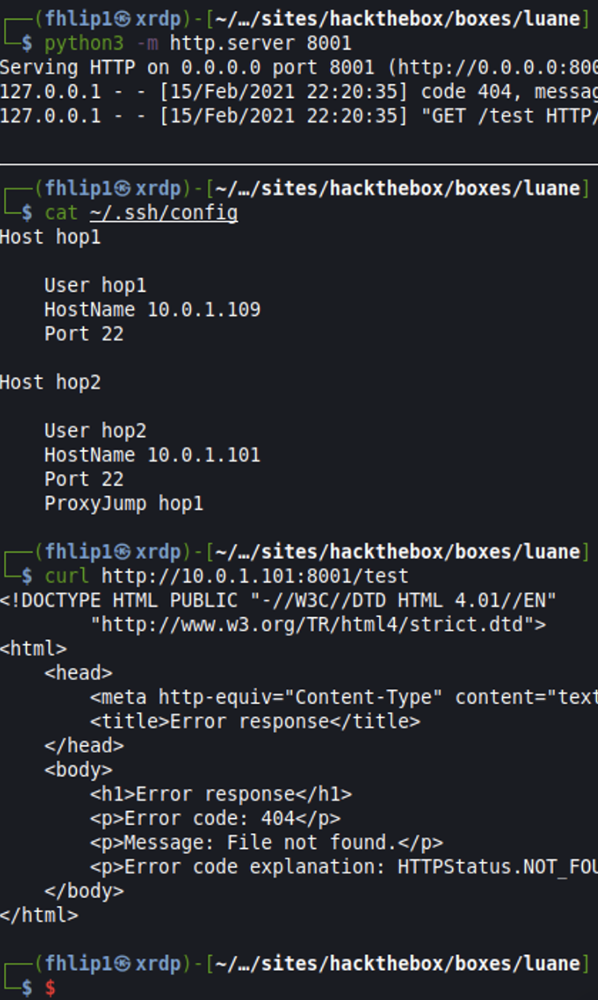

## Dante HTB Pro Lab Review


[tldr](#tldr)   
[pivots](#pivots)   
[c2_usage](#c2_usage)  


### TLDR:  
Dante is an awesome lab (im avoid the use of the word beginner here) that combines pivoting, customer exploitation, and simple enumeration challenges into one fun environment. I say fun after having left and returned to this lab 3 times over the last months since its release. The important thing to remember is keeping it simple, common exploits and credentials re-use are rampant in Dante so be sure to harvest creds from each compromised host and grep each one for the "DANTE{" flag in case you leave one behind. I came out of it with a nice refresher on CTF labs since CRTO in 2020 and OSCP in 2018, and am using this as my first descent sized article more for my own reference but if someone find its useful, thats cool too.


### Pivots
Pretty sure I bought access to Dante the day it came out, super exicted, I ripped into the lab and got to work. I distinctly remember the first hop being a nice refreshing dip in then boom, you're in open water.

Everything from here on either happens from local on the first hop machine or through a proxy / ssh forward / ssh reverse port forward. An ssh dynamic proxy tunnel
```
ssh -f -N -D 8888 root@dante-ip
```
made for easy access to resource on the first hop via firefox / foxyproxy but getting shells to call back after that basically needed a reverse proxy. Below is my lab version of what pivots looked like as to not spoint but the principle basically is:

get root on first hop, add your user public key to /root/.ssh/authorized_keys, then configure .ssh/config file on your local machine. My ssh config file shows 2 hops deep using proxyjump.

```
ssh config

Host hop1
	User hop1
	Hostname 10.0.1.109
	Port 22

Host hop2
	User hop2
	Hostname 10.0.1.101
	Port 22
	ProxyJump hop1
```

Important to note that for this method to work, you must change sshd_config gateway ports to yes and restart ssh on each hop.

So now ```ssh -R 8001:10.0.1.122:8001 hop2``` carries port 8001 from my local box, to the hop2 machine exposing it to the rest of that internal network.

For two hops this time
```ssh -R 8001:127.0.01:8001 hop2``` tells ssh to carry local port 8001 through each hop resulting on a listening port on hop2 that'll reach back to our attacker box. Seen below is an example of my ssh config, then demonstrating the connection to hop2:8001 calling back to my local kali python3 web server.




### Enumeration

Seriously keep this one simple, enumerate the hosts through your pivot and just pick one. You'll find the low hanging fruit in no time and start popping shells. From there, cred use kicks in and you'll need to be diliegent about popping a box, harvesting creds, and then checking for reuse on other boxes. Same goes for checking local accounts for interesting things that may point to a next hop or step in the game.


### C2_Usage

This falls under the "dont overthink it" category again. While its tempting to spend hours getting cobalt strike / covenant working in this lab, its not necessary here. The lab reverts frequently enough that any foothold / persistence will be wiped out the next day. Some exercises did require an AV Evasive payload but this can be accomplished by a variable renamed Invoke-PowershellTcp.ps1 all the same.

Nothing else really to add for now, dante good, procrastination and overthinking bad
