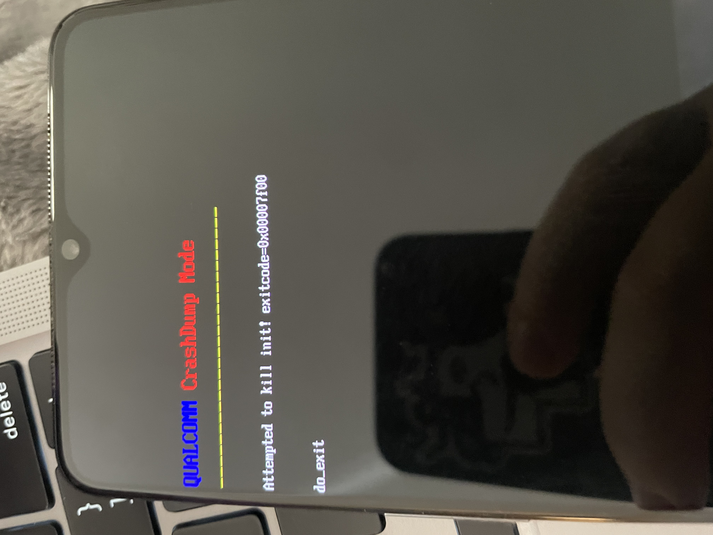

Rooting my new testing toy - oneplus 7t, and attempting to live note / blog it up here so i have steps to follow in the future again

Platform tools for mac
https://dl.google.com/android/repository/platform-tools-latest-darwin.zip

Enable developer options from settings / about / tab software versiom 5 times
Enable usb debugging and oem unlocking in settings

./adb reboot bootloader

./fastboot oem unlock
! If error on unlocking, you didnt enable oem unlocking
select unlock bootloader and allow the device to wipe

flash twrp
https://dl.twrp.me/hotdog/twrp-installer-3.6.0_11-0-hotdog.zip

install magisk
https://github.com/topjohnwu/Magisk/releases/download/v24.1/Magisk-v24.1.apk

errrr it was at this point, that i fucked up


In my rush to install twrp - i flashed the whole phone with twrp... thus i can get twrp and not the actual OS now...   
https://www.droidwin.com/restore-oneplus-7-7t-pro-stock-via-fastboot-commands/   

retreived stock os from https://www.oneplus.in/support/softwareupgrade   

comes as a zip and a payload.bin file? - need to unpack it apparently - https://www.mediafire.com/file/pslxh616isribx6/payload_dumper.zip/file   

`python3 ./payload_dumper.py ../payload.bin`   


copied my fastboot command from platform tools into the output folder  

reboot back to fastboot   

now run this pile of fastbook

```
./fastboot -w
./fastboot flash aop_a aop.img
./fastboot flash aop_b aop.img
./fastboot flash bluetooth_a bluetooth.img
./fastboot flash bluetooth_b bluetooth.img
./fastboot flash boot_a boot.img
./fastboot flash boot_b boot.img
./fastboot flash dsp_a dsp.img
./fastboot flash dsp_b dsp.img
./fastboot flash dtbo_a dtbo.img
./fastboot flash dtbo_b dtbo.img
./fastboot flash modem_a modem.img
./fastboot flash modem_b modem.img
./fastboot flash oem_stanvbk oem_stanvbk.img
./fastboot flash qupfw_a qupfw.img
./fastboot flash qupfw_b qupfw.img
./fastboot flash storsec_a storsec.img
./fastboot flash storsec_b storsec.img
./fastboot flash system_a system.img
./fastboot flash system_b system.img
./fastboot flash vbmeta_a vbmeta.img
./fastboot flash vbmeta_b vbmeta.img
./fastboot flash vendor_a vendor.img
./fastboot flash vendor_b vendor.img
./fastboot flash LOGO_a LOGO.img
./fastboot flash LOGO_b LOGO.img
./fastboot reboot bootloader
```


output from this pile   
```
Erasing 'userdata'                                 OKAY [  0.566s]
/Users/fhlip0/pentest/platform-tools/payload/payload_dumper/output/make_f2fs failed with status 1
fastboot: error: Cannot generate image for userdata
Sending 'aop_a' (200 KB)                           OKAY [  0.016s]
Writing 'aop_a'                                    FAILED (remote: 'Flashing is not allowed for Critical Partitions
')
fastboot: error: Command failed
Sending 'aop_b' (200 KB)                           OKAY [  0.013s]
Writing 'aop_b'                                    FAILED (remote: 'Flashing is not allowed for Critical Partitions
')
fastboot: error: Command failed
Sending 'bluetooth_a' (828 KB)                     OKAY [  0.034s]
Writing 'bluetooth_a'                              FAILED (remote: 'Flashing is not allowed for Critical Partitions
')
fastboot: error: Command failed
Sending 'bluetooth_b' (828 KB)                     OKAY [  0.034s]
Writing 'bluetooth_b'                              FAILED (remote: 'Flashing is not allowed for Critical Partitions
')
fastboot: error: Command failed
Sending 'boot_a' (98304 KB)                        OKAY [  2.579s]
Writing 'boot_a'                                   OKAY [  0.507s]
Finished. Total time: 3.104s
Sending 'boot_b' (98304 KB)                        OKAY [  2.475s]
Writing 'boot_b'                                   OKAY [  0.466s]
Finished. Total time: 2.959s
Sending 'dsp_a' (65536 KB)                         OKAY [  1.711s]
Writing 'dsp_a'                                    FAILED (remote: 'Flashing is not allowed for Critical Partitions
')
fastboot: error: Command failed
Sending 'dsp_b' (65536 KB)                         OKAY [  1.667s]
Writing 'dsp_b'                                    FAILED (remote: 'Flashing is not allowed for Critical Partitions
')
fastboot: error: Command failed
Sending 'dtbo_a' (16384 KB)                        OKAY [  0.426s]
Writing 'dtbo_a'                                   OKAY [  0.082s]
Finished. Total time: 0.521s
Sending 'dtbo_b' (16384 KB)                        OKAY [  0.409s]
Writing 'dtbo_b'                                   OKAY [  0.178s]
Finished. Total time: 0.600s
Sending 'modem_a' (166708 KB)                      OKAY [  4.411s]
Writing 'modem_a'                                  OKAY [  0.740s]
Finished. Total time: 5.165s
Sending 'modem_b' (166708 KB)                      OKAY [  4.134s]
Writing 'modem_b'                                  OKAY [  0.726s]
Finished. Total time: 4.873s
Sending 'oem_stanvbk' (2480 KB)                    OKAY [  0.071s]
Writing 'oem_stanvbk'                              OKAY [  0.011s]
Finished. Total time: 0.097s
Sending 'qupfw_a' (72 KB)                          OKAY [  0.011s]
Writing 'qupfw_a'                                  FAILED (remote: 'Flashing is not allowed for Critical Partitions
')
fastboot: error: Command failed
Sending 'qupfw_b' (72 KB)                          OKAY [  0.014s]
Writing 'qupfw_b'                                  FAILED (remote: 'Flashing is not allowed for Critical Partitions
')
Writing 'storsec_a'                                FAILED (remote: 'Flashing is not allowed for Critical Partitions
')
fastboot: error: Command failed
Sending 'storsec_b' (24 KB)                        OKAY [  0.006s]
Writing 'storsec_b'                                FAILED (remote: 'Flashing is not allowed for Critical Partitions
')
fastboot: error: Command failed
Invalid sparse file format at header magic
Sending sparse 'system_a' 1/2 (786292 KB)          OKAY [ 19.310s]
Writing 'system_a'                                 FAILED (remote: 'Partition not found')
fastboot: error: Command failed
Invalid sparse file format at header magic
Sending sparse 'system_b' 1/2 (786292 KB)          OKAY [ 19.255s]
Writing 'system_b'                                 FAILED (remote: 'Partition not found')
fastboot: error: Command failed
Sending 'vbmeta_a' (8 KB)                          OKAY [  0.006s]
Writing 'vbmeta_a'                                 OKAY [  0.003s]
Finished. Total time: 0.023s
Sending 'vbmeta_b' (8 KB)                          OKAY [  0.009s]
Writing 'vbmeta_b'                                 OKAY [  0.003s]
Finished. Total time: 0.026s
Invalid sparse file format at header magic
Sending sparse 'vendor_a' 1/2 (786269 KB)          OKAY [ 19.118s]
Writing 'vendor_a'                                 FAILED (remote: 'Partition not found')
fastboot: error: Command failed
Invalid sparse file format at header magic
Sending sparse 'vendor_b' 1/2 (786269 KB)          OKAY [ 18.581s]
Writing 'vendor_b'                                 FAILED (remote: 'Partition not found')
fastboot: error: Command failed
Sending 'LOGO_a' (7780 KB)                         OKAY [  0.205s]
Writing 'LOGO_a'                                   OKAY [  0.053s]
Finished. Total time: 0.273s
Sending 'LOGO_b' (7780 KB)                         OKAY [  0.191s]
Writing 'LOGO_b'                                   OKAY [  0.061s]
Finished. Total time: 0.265s
Rebooting into bootloader                          OKAY [  0.002s]
Finished. Total time: 0.002s

```
soooo i might have made it worse? lots of criitical partition not allowed?
```
fastboot flashing unlock
fastboot flashing unlock_critical
```

rebooting to see if its alive   

nope... 

   

exit using   
Oneplus – Press and Hold Power Button + Volume Down + Volume Up (all at the same time), keep holding till fastboot is up

tried restoring with same again... same issue    

further commands? 
```
./fastboot -w
./fastboot flash aop aop.img
./fastboot flash bluetooth bluetooth.img
./fastboot flash boot boot.img
./fastboot flash dsp dsp.img
./fastboot flash dtbo dtbo.img
./fastboot flash LOGO LOGO.img
./fastboot flash modem modem.img
./fastboot flash oem_stanvbk oem_stanvbk.img
./fastboot flash qupfw qupfw.img
./fastboot flash storsec storsec.img
./fastboot flash multiimgoem multiimgoem.img
./fastboot flash uefisecapp uefisecapp.img
./fastboot flash recovery recovery.img
./fastboot --disable-verity flash vbmeta vbmeta.img
./fastboot --disable-verity flash vbmeta_system vbmeta_system.img
./fastboot flash opproduct opproduct.img
./fastboot reboot fastboot
died here and never picked back up on its own, had to control c and run the last 3
./fastboot flash system system.img
./fastboot flash vendor vendor.img
./fastboot flash product product.img

```

sitting on the tmobile screen for a good few minutes now....    

20 minutes later... forcing a reboot and wiping again?

```
./fastboot flash boot ./twrp-3.6.0_11-0-hotdog.img

```


a few hours later... 

fastboot flash boot lineage recovery from https://download.lineageos.org/guacamole    
SIGNS OF LIFE   


aaaaand 24 hours more later   
https://rootmygalaxy.net/unbrick-t-mobile-oneplus-7t-and-restore-using-msm-tool/

msm "unbrick tool" for my tmobile specific oneplus7t did the trip, booted in EDL mode and let it do its job... so glad i tried this before attempting some hell with parted and trying to manually recreate the missing system partition    


soooooo no back to the beginning of saturday, i need to root and basic setup    
nice and easy this time - https://forum.xda-developers.com/t/guide-android-11-how-to-root-oneplus-7t.4253183/  


developer options / build 7 times / developer options enabled, unlocking oem unlocking enabled  
oem unlocking fails, its definitely ticked in settings

running through the get_unlock_code deal and waiting for the code from oneplus / tmobile    
https://www.oneplus.com/support/answer/detail/op588


03-7-2022 - UNLOCK CODE ARRIVED - https://www.oneplus.com/unlock_token?type=1&apply_id=NUMBER

IMEI : 9900*******004
Serial Number : 49***aa3
Email : fhl******@gmail.com
Status : Finished
Update time : 2022.03.07 07:38:12

```
./fastboot flash cust-unlock ./unlock_code.bin
./fastbook oem unlock

./fastbook flash recovery ./twrp-3.6.0_11-0-hotdog.img

copied over magisk apk from - https://github.com/topjohnwu/Magisk/releases/tag/v24.2   
booted recovery / twrp   
installed magisk.apk   
reboot   


now to get SSL pinning bypassed...  

navigate to burp proxy in chrome  
download burp cert and rename der to cer  
install for wifi and apps / vpn  
add this module (zipped) to magisk - https://github.com/NVISOsecurity/MagiskTrustUserCerts/releases/tag/v0.4.1    
traffic is now proxying successfully   


added bonus of hiding magisk and deny listing the target app to bypass root detection

```